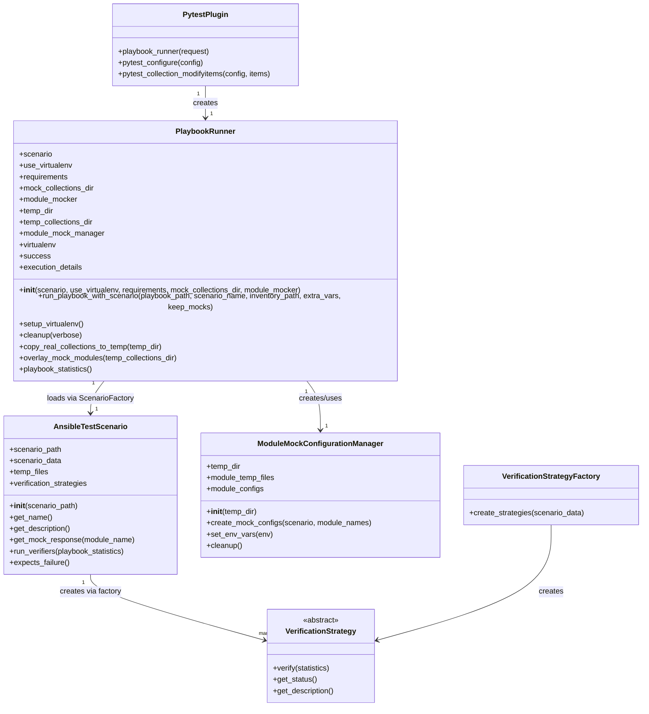
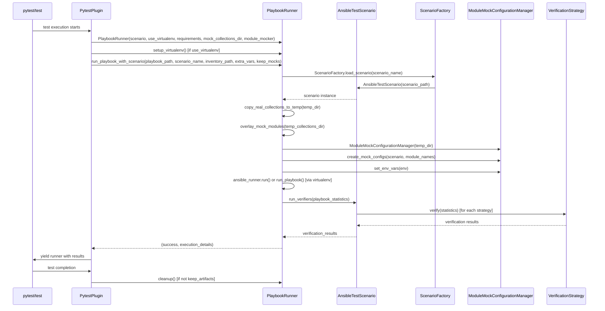

```mermaid
classDiagram
    class PlaybookRunner {
        +scenario
        +use_virtualenv
        +requirements
        +mock_collections_dir
        +module_mocker
        +temp_dir
        +temp_collections_dir
        +module_mock_manager
        +virtualenv
        +success
        +execution_details
        +__init__(scenario, use_virtualenv, requirements, mock_collections_dir, module_mocker)
        +run_playbook_with_scenario(playbook_path, scenario_name, inventory_path, extra_vars, keep_mocks)
        +setup_virtualenv()
        +cleanup(verbose)
        +copy_real_collections_to_temp(temp_dir)
        +overlay_mock_modules(temp_collections_dir)
        +playbook_statistics()
    }
    class AnsibleTestScenario {
        +scenario_path
        +scenario_data
        +temp_files
        +verification_strategies
        +__init__(scenario_path)
        +get_name()
        +get_description()
        +get_mock_response(module_name)
        +run_verifiers(playbook_statistics)
        +expects_failure()
    }
    class ModuleMockConfigurationManager {
        +temp_dir
        +module_temp_files
        +module_configs
        +__init__(temp_dir)
        +create_mock_configs(scenario, module_names)
        +set_env_vars(env)
        +cleanup()
    }
    class VerificationStrategy {
        <<abstract>>
        +verify(statistics)
        +get_status()
        +get_description()
    }
    class VerificationStrategyFactory {
        +create_strategies(scenario_data)
    }
    class PytestPlugin {
        +playbook_runner(request)
        +pytest_configure(config)
        +pytest_collection_modifyitems(config, items)
    }

    PytestPlugin "1" --> "1" PlaybookRunner : creates
    PlaybookRunner "1" --> "1" ModuleMockConfigurationManager : creates/uses
    PlaybookRunner "1" --> "1" AnsibleTestScenario : loads via ScenarioFactory
    AnsibleTestScenario "1" --> "many" VerificationStrategy : creates via factory
    VerificationStrategyFactory --> VerificationStrategy : creates
```

```mermaid
sequenceDiagram
    participant Test as pytest/test
    participant Plugin as PytestPlugin
    participant Runner as PlaybookRunner
    participant Scenario as AnsibleTestScenario
    participant Factory as ScenarioFactory
    participant MockMgr as ModuleMockConfigurationManager
    participant Verifiers as VerificationStrategy

    Test->>Plugin: test execution starts
    Plugin->>Runner: PlaybookRunner(scenario, use_virtualenv, requirements, mock_collections_dir, module_mocker)
    Plugin->>Runner: setup_virtualenv() [if use_virtualenv]
    Plugin->>Runner: run_playbook_with_scenario(playbook_path, scenario_name, inventory_path, extra_vars, keep_mocks)
    Runner->>Factory: ScenarioFactory.load_scenario(scenario_name)
    Factory->>Scenario: AnsibleTestScenario(scenario_path)
    Scenario-->>Runner: scenario instance
    Runner->>Runner: copy_real_collections_to_temp(temp_dir)
    Runner->>Runner: overlay_mock_modules(temp_collections_dir)
    Runner->>MockMgr: ModuleMockConfigurationManager(temp_dir)
    Runner->>MockMgr: create_mock_configs(scenario, module_names)
    Runner->>MockMgr: set_env_vars(env)
    Runner->>Runner: ansible_runner.run() or run_playbook() [via virtualenv]
    Runner->>Scenario: run_verifiers(playbook_statistics)
    Scenario->>Verifiers: verify(statistics) [for each strategy]
    Verifiers-->>Scenario: verification results
    Scenario-->>Runner: verification_results
    Runner-->>Plugin: (success, execution_details)
    Plugin->>Test: yield runner with results
    Test->>Plugin: test completion
    Plugin->>Runner: cleanup() [if not keep_artifacts]
```
