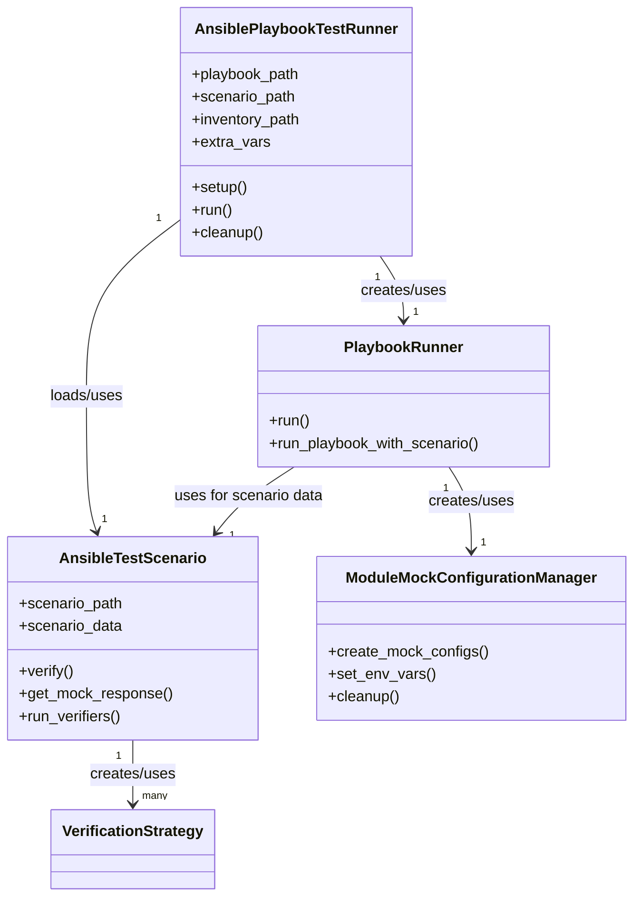
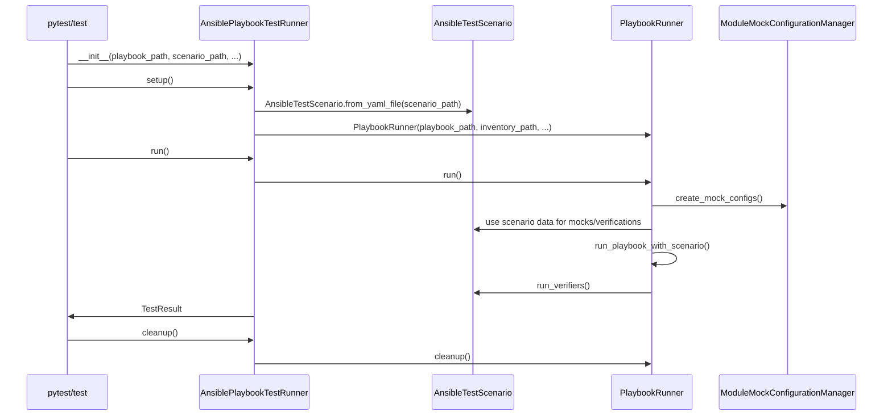

```mermaid
classDiagram
    class AnsiblePlaybookTestRunner {
        +playbook_path
        +scenario_path
        +inventory_path
        +extra_vars
        +setup()
        +run()
        +cleanup()
    }
    class PlaybookRunner {
        +run()
        +run_playbook_with_scenario()
    }
    class AnsibleTestScenario {
        +scenario_path
        +scenario_data
        +verify()
        +get_mock_response()
        +run_verifiers()
    }
    class ModuleMockConfigurationManager {
        +create_mock_configs()
        +set_env_vars()
        +cleanup()
    }

    AnsiblePlaybookTestRunner "1" --> "1" PlaybookRunner : creates/uses
    AnsiblePlaybookTestRunner "1" --> "1" AnsibleTestScenario : loads/uses
    PlaybookRunner "1" --> "1" ModuleMockConfigurationManager : creates/uses
    PlaybookRunner "1" --> "1" AnsibleTestScenario : uses for scenario data
    AnsibleTestScenario "1" --> "many" VerificationStrategy : creates/uses
```

```mermaid
sequenceDiagram
    participant Test as pytest/test
    participant Runner as AnsiblePlaybookTestRunner
    participant Scenario as AnsibleTestScenario
    participant PBRunner as PlaybookRunner
    participant MockMgr as ModuleMockConfigurationManager

    Test->>Runner: __init__(playbook_path, scenario_path, ...)
    Test->>Runner: setup()
    Runner->>Scenario: AnsibleTestScenario.from_yaml_file(scenario_path)
    Runner->>PBRunner: PlaybookRunner(playbook_path, inventory_path, ...)
    Test->>Runner: run()
    Runner->>PBRunner: run()
    PBRunner->>MockMgr: create_mock_configs()
    PBRunner->>Scenario: use scenario data for mocks/verifications
    PBRunner->>PBRunner: run_playbook_with_scenario()
    PBRunner->>Scenario: run_verifiers()
    Runner->>Test: TestResult
    Test->>Runner: cleanup()
    Runner->>PBRunner: cleanup()
```
